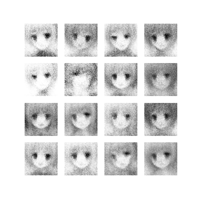

# ✈✈✈ GAN-Anime_face_auto_generator ✈✈✈

Use GAN net to generate anime face

### How to use:

    put train picture in ./data/ than run ./generate(Grayscale).py if you want to generate gray picture

### Train Result Show (epochs 120)
##### Grayscale
